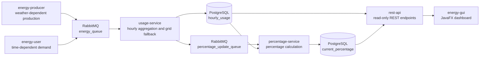

# Energy Community Project

Distributed Systems course project for simulating an energy community. The system is intentionally built from six independently startable applications that communicate through REST, RabbitMQ JSON messages, and a shared PostgreSQL database.

## Final Submission Summary

This project uses **Java 25** and **Spring Boot 4.0.3**. The project was built and tested with this stack. If another machine is used for the final demo, install Java 25 or adapt the project to Java 21 LTS before running the Maven commands.

The grading-critical architecture is:

```text
Energy Producer -> RabbitMQ -> Usage Service -> PostgreSQL
Energy User     -> RabbitMQ -> Usage Service -> PostgreSQL
Usage Service   -> RabbitMQ -> Percentage Service -> PostgreSQL
JavaFX GUI      -> REST API -> PostgreSQL
```

The GUI never connects to PostgreSQL directly. The REST API reads PostgreSQL and does not calculate or write the core business values. Producer and User services do not write to the database.



## Components

| Component | Path | Port | Start Command | Responsibility |
|---|---|---:|---|---|
| Energy Producer | `energy-producer` | n/a | `.\mvnw.cmd spring-boot:run` | Publishes weather-dependent, randomly varied `PRODUCER` messages. |
| Energy User | `energy-user` | n/a | `.\mvnw.cmd spring-boot:run` | Publishes time-of-day-dependent `USER` messages. |
| Usage Service | `usage-service` | n/a | `.\mvnw.cmd spring-boot:run` | Consumes producer/user messages, aggregates hourly usage, writes `hourly_usage`, publishes usage updates after the DB commit. |
| Percentage Service | `percentage-service` | n/a | `.\mvnw.cmd spring-boot:run` | Consumes usage updates for the current hour, calculates rounded percentages, writes `current_percentage`. |
| REST API | `rest-api` | 8080 | `.\mvnw.cmd spring-boot:run` | Read-only API for current and historical energy data. |
| JavaFX GUI | `energy-gui` | n/a | `..\energy-producer\mvnw.cmd -f pom.xml javafx:run` | Desktop GUI that calls only the REST API. |

Each component has its own `pom.xml` and own application entry point. Start components in separate terminals for the final demo.

## Technology Choices

| Technology | Where It Is Used | Why It Is Used |
|---|---|---|
| Spring Boot | Five backend applications | Gives each backend component an independent application lifecycle and consistent configuration. |
| RabbitMQ | Producer/User -> Usage and Usage -> Percentage | Carries asynchronous JSON events so calculation services do not need direct runtime references to each other. |
| PostgreSQL | Shared persistence | Stores hourly aggregates and calculated percentages so REST reads stable data instead of transient messages. |
| Flyway + JPA | DB-backed services | Flyway defines the schema; JPA maps Java entities to the validated schema. |
| Spring Web MVC REST | `rest-api` | Exposes a narrow read-only boundary for clients. |
| JavaFX | `energy-gui` | Implements the required desktop UI without database or broker access. |
| Docker Compose | PostgreSQL and RabbitMQ | Starts the required infrastructure repeatably for development and the final demo. |

The GUI uses REST only because it is a presentation client, not a business service. It should not know database credentials, table structure, or RabbitMQ contracts. Keeping the GUI behind `rest-api` also makes the UI replaceable without changing persistence or messaging.

The backend services use RabbitMQ messages because production, consumption, aggregation, and percentage calculation are separate responsibilities. Asynchronous events keep these applications independently startable and allow RabbitMQ to buffer work if a consumer is temporarily slower or starts later.

## Prerequisites

| Tool | Required | Purpose |
|---|---|---|
| JDK | Java 25 tested | Build and run all Java modules. |
| Maven Wrapper | included in service modules | Build/run without local Maven installation. |
| Docker Desktop | 4.x or newer | Runs PostgreSQL and RabbitMQ. |
| PostgreSQL | via Docker Compose | Shared persistence. |
| RabbitMQ | via Docker Compose | Asynchronous service communication. |
| JavaFX | Maven dependencies in `energy-gui` | Desktop GUI. |

## Infrastructure

Start PostgreSQL and RabbitMQ from the repository root:

```powershell
docker compose up -d
docker compose ps
```

Ports and credentials:

| Service | URL / Port | Credentials |
|---|---|---|
| PostgreSQL | `localhost:5432`, database `energy_community` | user `user`, password `password` |
| RabbitMQ AMQP | `localhost:5672` | user `guest`, password `guest` |
| RabbitMQ Management UI | `http://localhost:15672` | user `guest`, password `guest` |

## Build Commands

Run from a clean PowerShell terminal:

```powershell
cd energy-producer
.\mvnw.cmd clean package

cd ..\energy-user
.\mvnw.cmd clean package

cd ..\usage-service
.\mvnw.cmd clean package

cd ..\percentage-service
.\mvnw.cmd clean package

cd ..\rest-api
.\mvnw.cmd clean package

cd ..
.\energy-producer\mvnw.cmd -f .\energy-gui\pom.xml clean package
```

The tests are isolated. They use mocks or H2 where needed and do not require a live RabbitMQ or PostgreSQL instance.

## Start Order

Start in this order for the final demo:

```text
1. docker compose up -d
2. usage-service
3. percentage-service
4. rest-api
5. energy-producer
6. energy-user
7. energy-gui
```

Commands:

```powershell
cd usage-service
.\mvnw.cmd spring-boot:run
```

```powershell
cd percentage-service
.\mvnw.cmd spring-boot:run
```

```powershell
cd rest-api
.\mvnw.cmd spring-boot:run
```

```powershell
cd energy-producer
.\mvnw.cmd spring-boot:run
```

```powershell
cd energy-user
.\mvnw.cmd spring-boot:run
```

```powershell
cd energy-gui
..\energy-producer\mvnw.cmd -f pom.xml javafx:run
```

Optional producer offline/weather fallback mode:

```powershell
cd energy-producer
.\mvnw.cmd spring-boot:run "-Dspring-boot.run.arguments=--app.weather.mode=fallback"
```

## REST API

Required endpoints:

```http
GET http://localhost:8080/energy/current
GET http://localhost:8080/energy/historical?start=2026-05-16T00:00:00&end=2026-05-16T23:59:59
```

The historical endpoint accepts ISO local datetime and the GUI format `dd.MM.yyyy HH:mm`.

Example:

```powershell
curl http://localhost:8080/energy/current
curl "http://localhost:8080/energy/historical?start=2026-05-16T00:00:00&end=2026-05-16T23:59:59"
```

Current response fields:

```json
{
  "hour": "2026-05-16T10:00",
  "communityDepleted": 100.0,
  "gridPortion": 5.63
}
```

Historical response fields:

```json
[
  {
    "hour": "2026-05-16T10:00",
    "communityProduced": 18.05,
    "communityUsed": 18.05,
    "gridUsed": 1.076
  }
]
```

## RabbitMQ Topology

The implementation uses durable direct queues. This is sufficient for the current project because each message stream has exactly one consumer service.

```text
Energy Producer -> energy_queue -> Usage Service
Energy User     -> energy_queue -> Usage Service
Usage Service   -> percentage_update_queue -> Percentage Service
```

Why RabbitMQ is used:

- Producer/User and Usage Service are asynchronously decoupled.
- Usage Service and Percentage Service are asynchronously decoupled.
- Producer/User do not need a direct reference to Usage Service.
- Percentage Service reacts to usage-update events instead of polling the database.

If more consumers need the same stream later, the direct queues can be replaced with an exchange and per-service queues, for example a topic exchange with routing keys such as `energy.producer.created`, `energy.user.created`, and `energy.usage.updated`.

Message contracts are documented in [docs/message-contract.md](docs/message-contract.md).

## Database Schema

The database schema is managed by Flyway in the DB-backed modules:

- `usage-service/src/main/resources/db/migration/V1__create_energy_tables.sql`
- `percentage-service/src/main/resources/db/migration/V1__create_energy_tables.sql`
- `rest-api/src/main/resources/db/migration/V1__create_energy_tables.sql`

Hibernate validates the schema:

```properties
spring.jpa.hibernate.ddl-auto=validate
```

Implemented tables:

| Table | Responsibility | Writer | Readers |
|---|---|---|---|
| `hourly_usage` | Aggregated hourly energy usage. Conceptually equivalent to `energy_usage_hourly` in the project mapping. | Usage Service | Percentage Service, REST API |
| `current_percentage` | Percentage values for the current hour only. | Percentage Service | REST API |

Detailed schema mapping is documented in [docs/database-schema.md](docs/database-schema.md).

## Business Rules

Calculation ownership:

| Calculation | Component | Result |
|---|---|---|
| Weather-dependent production amount | Energy Producer | Publishes a `PRODUCER` event to `energy_queue`. |
| Time-of-day-dependent demand amount | Energy User | Publishes a `USER` event to `energy_queue`. |
| Hour bucket, community allocation, and grid fallback | Usage Service | Updates `hourly_usage` and publishes an update event. |
| Community depletion and grid portion percentages | Percentage Service | Updates `current_percentage`. |
| No calculations | REST API and JavaFX GUI | REST reads stored values; GUI renders REST responses. |

Energy Producer calculates a weather-dependent value between the configured minimum and maximum production:

```text
daylightFactor = daylight ? 1.0 : 0.12
cloudFactor = 1.0 - cloudCoverPercent / 100 * 0.70
radiationFactor = min(shortwaveRadiationWm2 / 800, 1.0)
weatherFactor = max(radiationFactor, daylightFactor * cloudFactor)
clampedFactor = clamp(weatherFactor, 0.05, 1.0)
weatherBasedKwh = minKwh + (maxKwh - minKwh) * clampedFactor
variation = random(-0.10, 0.10) * (maxKwh - minKwh)
producedKwh = clamp(weatherBasedKwh + variation, minKwh, maxKwh)
```

Energy User calculates time-dependent minute demand from a `0.001` kWh base plus a random variation below `0.002` kWh:

```text
requestedKwh = (0.001 + variationKwh) * timeOfDayMultiplier

timeOfDayMultiplier:
- 3.0 during 07:00-09:59 and 18:00-21:59
- 0.5 during 23:00-05:59
- 1.0 otherwise
```

Usage Service buckets every message to the full hour:

```text
2025-01-10T14:34 -> 2025-01-10T14:00
```

For `PRODUCER` messages:

```text
communityProduced += message.kwh
```

For `USER` messages:

```text
availableCommunityEnergy = communityProduced - communityUsed
communityPart = min(message.kwh, max(availableCommunityEnergy, 0))
gridPart = message.kwh - communityPart

communityUsed += communityPart
gridUsed += gridPart
```

Invariant:

```text
communityUsed <= communityProduced
```

There is no Grid Producer and no Grid Message. Grid energy is the fallback portion when community energy is not sufficient.

Message order is significant. If a `USER` event arrives before a later `PRODUCER` event for the same hour, the initially uncovered demand remains assigned to the grid; the service does not retroactively rebalance earlier usage.

Percentage Service formulas:

```text
communityDepleted = communityUsed / communityProduced * 100
gridPortion = gridUsed / (communityUsed + gridUsed) * 100
```

Division by zero returns `0`, and persisted percentage values are rounded to two decimals.

## JavaFX GUI

The GUI:

- calls `GET /energy/current` for current percentages,
- calls `GET /energy/historical?start=...&end=...` for historical data,
- contains no PostgreSQL/JPA/RabbitMQ dependency,
- shows API errors in the UI,
- displays historical values as aggregate labels for the selected range.

The REST API must be running on `http://localhost:8080` before starting the GUI.

## Final Demo Flow

For the full repeatable manual smoke test, use [docs/smoke-test.md](docs/smoke-test.md).

1. Show the Git branch and repository.
2. Show that six component folders exist and each has its own `pom.xml`.
3. Run `docker compose ps` and show PostgreSQL/RabbitMQ.
4. Start `usage-service`.
5. Start `percentage-service`.
6. Start `rest-api`.
7. Start `energy-producer` and show `PRODUCER` logs.
8. Start `energy-user` and show `USER` logs.
9. Open RabbitMQ Management UI and show `energy_queue` / `percentage_update_queue`.
10. Query PostgreSQL:
    - `SELECT * FROM hourly_usage ORDER BY hour DESC LIMIT 10;`
    - `SELECT * FROM current_percentage ORDER BY hour DESC LIMIT 10;`
11. Call REST endpoints with curl/browser.
12. Open JavaFX GUI, refresh current values, and query historical data.
13. Explain the flow: `Producer/User -> RabbitMQ -> Usage -> DB -> RabbitMQ -> Percentage -> DB -> REST -> GUI`.

## Team Contributions

Each team member must have own Git commits. The lecturer explicitly treats missing individual commits as a personal grading risk. Verify before submission:

```powershell
git shortlog -sn
```

Observed local commit authors during audit:

| Git Author | Commits Observed | Main Contribution Notes |
|---|---:|---|
| OnlyMajorG | 32 | Verify real name and contributions before submission. |
| Yijie Liu | 12 | Verify real name and contributions before submission. |
| stefangirgis | 7 | Verify real name and contributions before submission. |

Replace or extend this table with final real names, GitHub usernames, and actual contribution areas before hand-in if the submission requires personal attribution.

## Known Limitations

- The project uses Java 25 and Spring Boot 4.0.3 instead of the lecture reference versions. This is documented as an environment prerequisite.
- RabbitMQ uses direct durable queues instead of an explicit exchange/routing-key topology. This is intentional because each stream currently has one consumer.
- The implemented table `hourly_usage` is conceptually the project mapping table `energy_usage_hourly`.
- Audit timestamp columns such as `updated_at` and `calculated_at` are intentionally omitted in the current schema because the grading-relevant values are `hour`, usage totals, and percentage totals.
- Authentication, Kubernetes, cloud deployment, API gateway, and OAuth are not implemented because they are outside the project scope.
- Generated Maven `target/` files should not be tracked in Git. Run the cleanup checklist before final submission.

## Documentation

- [docs/documentation-overview.md](docs/documentation-overview.md): documentation index and QA reading path.
- Module documentation:
  - [docs/modules-documentation/energy-producer.md](docs/modules-documentation/energy-producer.md)
  - [docs/modules-documentation/energy-user.md](docs/modules-documentation/energy-user.md)
  - [docs/modules-documentation/usage-service.md](docs/modules-documentation/usage-service.md)
  - [docs/modules-documentation/percentage-service.md](docs/modules-documentation/percentage-service.md)
  - [docs/modules-documentation/rest-api.md](docs/modules-documentation/rest-api.md)
  - [docs/modules-documentation/energy-gui.md](docs/modules-documentation/energy-gui.md)
- [docs/message-contract.md](docs/message-contract.md): RabbitMQ topology and JSON contracts.
- [docs/database-schema.md](docs/database-schema.md): implemented DB schema and conceptual mapping.
- [docs/how-to-run.md](docs/how-to-run.md): detailed runbook.
- [docs/smoke-test.md](docs/smoke-test.md): full distributed smoke-test runbook for RabbitMQ, PostgreSQL, REST, and JavaFX verification.
- [docs/final-readiness-check.md](docs/final-readiness-check.md): final pre-submission checklist.
- [docs/spec-code-mapping.md](docs/spec-code-mapping.md): specification-to-code mapping.
