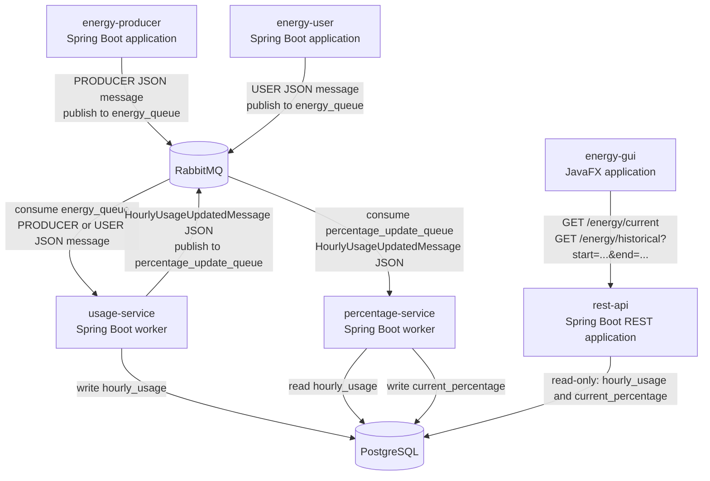

# Component Architecture

This document is the presentation-level component view of the distributed Energy Community system. Each application is independently startable and communicates only through the labeled interfaces.

## Component Diagram

## Independent Applications

| Application | Interface Boundary | Responsibility |
|---|---|---|
| `energy-producer` | Publishes `PRODUCER` JSON messages to `energy_queue`. | Calculates weather-dependent, randomly varied production values. |
| `energy-user` | Publishes `USER` JSON messages to `energy_queue`. | Calculates time-of-day-dependent, randomly varied demand values. |
| `usage-service` | Consumes `energy_queue`, writes `hourly_usage`, publishes `HourlyUsageUpdatedMessage` to `percentage_update_queue`. | Aggregates hourly values and assigns community energy before grid fallback. |
| `percentage-service` | Consumes `percentage_update_queue`, reads `hourly_usage`, writes `current_percentage`. | Calculates community depletion and grid portion for the updated hour. |
| `rest-api` | Exposes `GET /energy/current` and `GET /energy/historical?start=...&end=...`; reads PostgreSQL only. | Provides the read-only client boundary. |
| `energy-gui` | Calls only the REST endpoints. | Displays current percentages and historical totals in JavaFX. |

## Minimal Interfaces

The design intentionally uses a small set of interfaces:

| Interface | Producer | Consumer |
|---|---|---|
| RabbitMQ `energy_queue` | `energy-producer`, `energy-user` | `usage-service` |
| RabbitMQ `percentage_update_queue` | `usage-service` | `percentage-service` |
| PostgreSQL `hourly_usage` | `usage-service` | `percentage-service`, `rest-api` |
| PostgreSQL `current_percentage` | `percentage-service` | `rest-api` |
| `GET /energy/current` | `rest-api` | `energy-gui` |
| `GET /energy/historical?start=...&end=...` | `rest-api` | `energy-gui` |

The GUI has no RabbitMQ or database dependency. Producer and User have no database dependency. The REST API does not write tables or calculate the core business values.

## Related Documentation

- [Message contract](message-contract.md)
- [Database schema](database-schema.md)
- [Startup guide](how-to-run.md)
- [Module documentation](documentation-overview.md)
