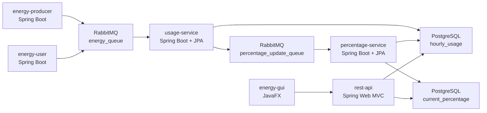

# Documentation Overview

This folder contains the technical and QA documentation for the Energy Community distributed system.

## System Architecture

## Module Documentation

| Module | Documentation | Runtime Responsibility |
|---|---|---|
| `energy-producer` | `docs/modules-documentation/energy-producer.md` | Publishes weather-dependent `PRODUCER` messages to RabbitMQ. |
| `energy-user` | `docs/modules-documentation/energy-user.md` | Publishes time-of-day-dependent `USER` messages to RabbitMQ. |
| `usage-service` | `docs/modules-documentation/usage-service.md` | Consumes energy messages, updates hourly usage, publishes usage updates. |
| `percentage-service` | `docs/modules-documentation/percentage-service.md` | Consumes usage updates, calculates current percentages, writes percentage data. |
| `rest-api` | `docs/modules-documentation/rest-api.md` | Provides read-only DB-backed REST endpoints for GUI. |
| `energy-gui` | `docs/modules-documentation/energy-gui.md` | JavaFX client that calls only the REST API. |

## Cross-Cutting Documentation

| Document | Purpose |
|---|---|
| `docs/architecture.md` | Presentation-level component diagram with explicit interfaces. |
| `docs/message-contract.md` | RabbitMQ topology, JSON payloads, contract tests. |
| `docs/database-schema.md` | PostgreSQL table mapping and service read/write responsibilities. |
| `docs/how-to-run.md` | Detailed startup and troubleshooting instructions. |
| `docs/smoke-test.md` | Repeatable distributed smoke-test runbook. |
| `docs/final-readiness-check.md` | Final pre-submission checklist and last smoke evidence. |
| `docs/final-regression-checklist.md` | Grading-traceable hand-in checklist: one section per grading category, copyable commands. |
| `docs/independent-startup-verification.md` | Independent startup and port/config isolation verification. |
| `docs/spec-code-mapping.md` | Mapping between specification/grading risks and implementation. |
| `docs/project-status.md` | Current readiness state and remaining manual checks. |
| `docs/final-specification-audit-report.md` | Detailed specification audit and presentation-readiness baseline. |

## QA Reading Path

For a reviewer or team member preparing for the final presentation:

1. Read `README.MD` for the high-level system and start commands.
2. Read this overview.
3. Read `docs/architecture.md`, `docs/message-contract.md`, and `docs/database-schema.md`.
4. Read the module document for the component you need to explain.
5. Execute `docs/smoke-test.md`.
6. Use `docs/final-regression-checklist.md` to verify every grading item, then
   `docs/final-readiness-check.md` as the final sign-off checklist.
