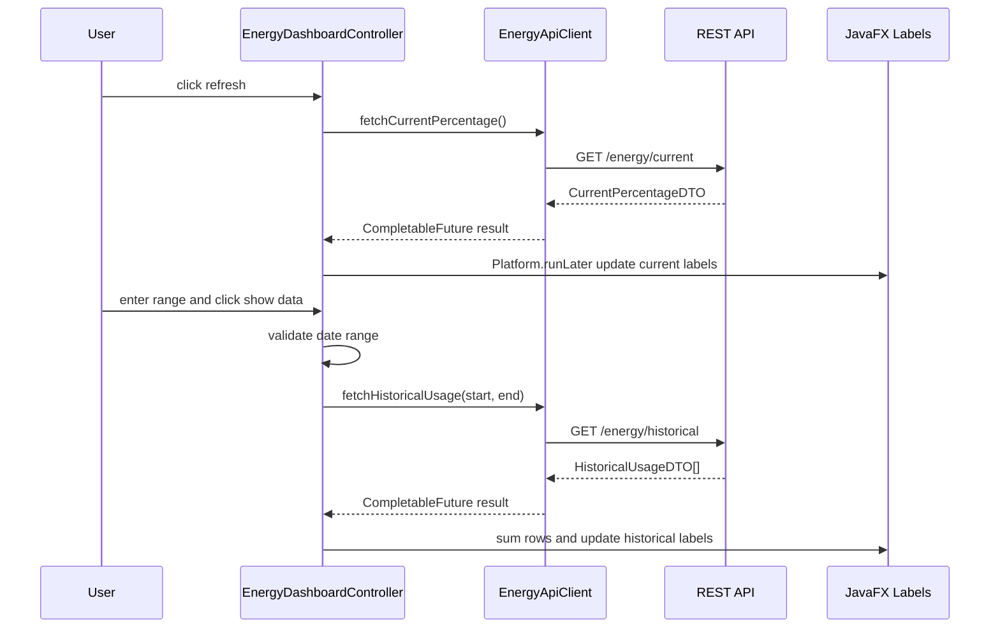

# JavaFX GUI Module

## Purpose

`energy-gui` is an independently startable JavaFX desktop application. It is the user-facing client for current percentage data and historical usage data.

It communicates only with the REST API over HTTP. It has no PostgreSQL, JPA, or RabbitMQ dependency.

## Tech Stack

| Area | Implementation |
|---|---|
| Runtime | Java 25 |
| UI | JavaFX 25.0.2 |
| HTTP | Java `HttpClient` |
| JSON | FasterXML Jackson `ObjectMapper` |
| Build | Maven, JavaFX Maven plugin |
| Tests | JUnit 5, AssertJ |

## Main Components

| Class / Package | Responsibility |
|---|---|
| `MainApp` | JavaFX launcher entry point configured in Maven. |
| `app/EnergyGuiApplication` | Creates the JavaFX scene and wires the controller/client. |
| `controller/EnergyDashboardController` | Builds UI controls, handles button actions, validates input, updates labels. |
| `client/EnergyApiClient` | HTTP client for REST API calls. |
| `dto/CurrentPercentageDTO` | DTO for `/energy/current`. |
| `dto/HistoricalUsageDTO` | DTO for `/energy/historical`. |

## Configuration

The GUI calls the REST API at `http://localhost:8080`, which is the fixed local review/demo setup.

## Startup Without REST

The GUI is independently startable even when the REST API is unavailable. The window opens
first, then the initial `/energy/current` call runs asynchronously. If the REST API is down,
the request fails the connect timeout and the labels show `Error fetching data` instead of
crashing. The same applies to the refresh and show-data actions, so the GUI degrades gracefully.

## UI Behavior

Current data:

- Refresh button calls `GET /energy/current`.
- GUI displays community pool depletion and grid portion as formatted labels.

Historical data:

- User enters start/end date as ISO local datetime, for example `2026-05-16T00:00`.
- Show-data button calls `GET /energy/historical?start=...&end=...`.
- GUI sums returned hourly rows and displays aggregate labels:
  - community produced,
  - community used,
  - grid used.

Current implementation note: historical rows are not displayed in a `TableView`; they are aggregated into labels.

## Runtime Flow


## Sequence Diagram



## Start Command

The GUI starts independently. The REST API should be running for live data; if it is not, the
GUI still opens and shows `Error fetching data` (see *Startup Without REST*).

```powershell
cd energy-gui
..\energy-producer\mvnw.cmd -f pom.xml javafx:run
```

## Verification

```powershell
cd ..
.\energy-producer\mvnw.cmd -f .\energy-gui\pom.xml test
```

Manual GUI check:

1. Start Docker, Usage Service, Percentage Service, REST API, Producer, and User.
2. Start the GUI.
3. Click refresh and verify current percentage labels.
4. Enter a date range that includes generated data.
5. Click show data and verify historical aggregate labels.
6. Confirm no database credentials or direct database connection are used by the GUI.
