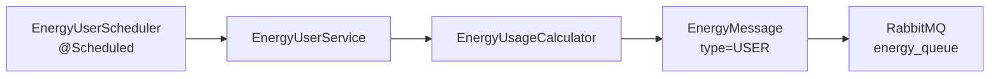

# Energy User Module

## Purpose

`energy-user` is an independently startable Spring Boot application. It simulates energy consumption by community users and publishes `USER` messages to RabbitMQ.

It does not read or write PostgreSQL and does not call the Usage Service directly.

## Tech Stack

| Area | Implementation |
|---|---|
| Runtime | Java 25 |
| Framework | Spring Boot 4.0.3 |
| Messaging | Spring AMQP, `RabbitTemplate`, JSON converter |
| Scheduling | Spring `@Scheduled` |
| Consumption logic | Time-of-day multiplier plus random variation |
| Tests | JUnit 5, AssertJ, Mockito, Spring Boot test support |

## Main Components

| Class / Package | Responsibility |
|---|---|
| `EnergyUserApplication` | Spring Boot entry point, scheduling enabled, AMQP JSON converter bean. |
| `messaging/EnergyMessage` | Service-local DTO published to RabbitMQ. Fields: `type`, `association`, `kwh`, `datetime`. |
| `scheduling/EnergyUserScheduler` | Periodically waits a short random delay and triggers usage publishing. |
| `service/EnergyUserService` | Creates user messages and publishes them to `energy_queue`. |
| `service/EnergyUsageCalculator` | Applies time-of-day consumption profile. |

## Configuration

File: `energy-user/src/main/resources/application.properties`

| Property | Current Value / Meaning |
|---|---|
| HTTP port | none; this module is a RabbitMQ publisher |
| `app.queue.name` | `energy_queue` |
| `app.scheduling.fixed-delay-ms` | `1000`; combined with a randomized `0-3999 ms` wait, events are published every `1-5` seconds. |
| `spring.autoconfigure.exclude` | Excludes JDBC/JPA autoconfiguration because this module must not use the database. |

## Consumption Profile

The current `EnergyUsageCalculator` uses:

| Time Window | Multiplier |
|---|---:|
| `07:00-09:59` | `3.0` |
| `18:00-21:59` | `3.0` |
| `23:00-05:59` | `0.5` |
| all other hours | `1.0` |

## Runtime Flow



## Message Contract

Published queue: `energy_queue`

```json
{
  "type": "USER",
  "association": "COMMUNITY",
  "kwh": 0.0025,
  "datetime": "2026-05-15T14:34:00"
}
```

The contract is documented in `docs/message-contract.md` and protected by `EnergyMessageContractTest`.

## Start Command

```powershell
cd energy-user
.\mvnw.cmd spring-boot:run
```

## Verification

```powershell
cd energy-user
.\mvnw.cmd test
```

Important checks:

- Message has `type=USER`.
- Message has `association=COMMUNITY`.
- kWh depends on time of day and variation.
- JSON fields match the documented RabbitMQ contract.
- No database dependency is configured.
