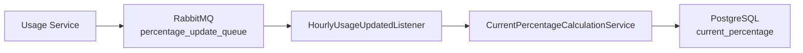
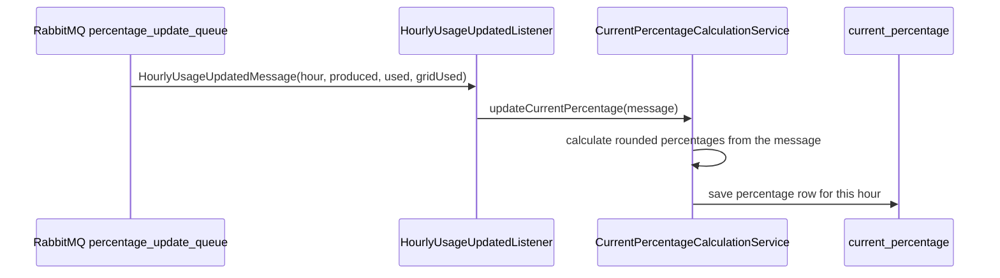

# Percentage Service Module

## Purpose

`percentage-service` is an independently startable Spring Boot application and the second grading-critical core service.

It consumes usage update messages from RabbitMQ, calculates percentage values **from the message payload**, and writes them to `current_percentage`. It does **not** read the `hourly_usage` table — the update message carries the full hourly snapshot, so the two core services never share a table read.

## Tech Stack

| Area | Implementation |
|---|---|
| Runtime | Java 25 |
| Framework | Spring Boot 4.0.3 |
| Messaging | Spring AMQP, `@RabbitListener`, JSON converter |
| Persistence | Spring Data JPA, Hibernate |
| Database | PostgreSQL at runtime |
| Migration | Flyway |

## Main Components

| Class / Package | Responsibility |
|---|---|
| `PercentageServiceApplication` | Spring Boot entry point. |
| `config/RabbitMqConfig` | Declares the update queue (`percentage_update_queue`) and the AMQP JSON converter as `@Bean`s. |
| `listener/HourlyUsageUpdatedListener` | RabbitMQ boundary. Receives `HourlyUsageUpdatedMessage`; on a processing error it logs and drops the message instead of letting Spring AMQP requeue it endlessly. |
| `messaging/HourlyUsageUpdatedMessage` | Service-local DTO consumed from Usage Service JSON. Carries the hour plus the hourly totals (`communityProduced`, `communityUsed`, `gridUsed`). |
| `entity/CurrentPercentageEntity` | Write model for table `current_percentage`. |
| `repository/CurrentPercentageRepository` | Writes percentage rows keyed by hour. |
| `service/CurrentPercentageCalculationService` | Validates the incoming totals, calculates rounded percentage values from the message, and saves one row per hour. |
| `db/migration/V1__create_energy_tables.sql` | Flyway migration for required tables. |

## Configuration

File: `percentage-service/src/main/resources/application.properties`

| Property | Current Value / Meaning |
|---|---|
| HTTP port | none; this module is a RabbitMQ worker |
| `app.update-queue.name` | `percentage_update_queue` |
| `spring.datasource.url` | `jdbc:postgresql://localhost:5432/energy_community` |
| `spring.jpa.hibernate.ddl-auto` | `validate` |

## Runtime Flow



## Calculation Rules

```text
communityDepleted = communityUsed / communityProduced * 100
```

If `communityProduced = 0`, `communityDepleted = 0`.

```text
gridPortion = gridUsed / (communityUsed + gridUsed) * 100
```

If `communityUsed + gridUsed = 0`, `gridPortion = 0`.

Both values are rounded to two decimals (`Math.round(value * 100) / 100`) before persistence.

Input guard: if `communityProduced`, `communityUsed`, or `gridUsed` is negative, the update is rejected
with an `IllegalArgumentException` (logged and dropped by the listener) instead of storing a negative
percentage. Saving uses `hour` as the primary key: the same hour is updated in place, older hourly rows stay.

## Sequence Diagram



## Start Command

```powershell
cd percentage-service
.\mvnw.cmd spring-boot:run
```

## Verification

```powershell
cd percentage-service
.\mvnw.cmd clean package
```

Behavior to confirm during the smoke test (`docs/smoke-test.md`):

- Consumes `percentage_update_queue`.
- Does not consume Producer/User messages.
- Does not read `hourly_usage`; calculates from the update message.
- Writes `current_percentage`.
- Avoids division by zero.
- Rounds persisted values to two decimals.
- Keeps historical hourly rows in `current_percentage`; updates the same hour in place.
