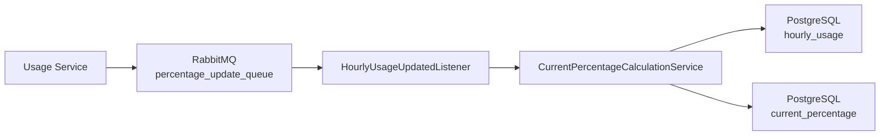
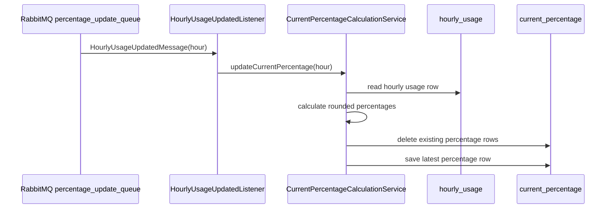

# Percentage Service Module

## Purpose

`percentage-service` is an independently startable Spring Boot application and the second grading-critical core service.

It consumes usage update messages from RabbitMQ, reads the matching hourly usage row from PostgreSQL, calculates percentage values, and writes them to `current_percentage`.

## Tech Stack

| Area | Implementation |
|---|---|
| Runtime | Java 25 |
| Framework | Spring Boot 4.0.3 |
| Messaging | Spring AMQP, `@RabbitListener`, JSON converter |
| Persistence | Spring Data JPA, Hibernate |
| Database | PostgreSQL at runtime, H2 in tests |
| Migration | Flyway |
| Tests | JUnit 5, Mockito, AssertJ, Spring Data JPA tests |

## Main Components

| Class / Package | Responsibility |
|---|---|
| `PercentageServiceApplication` | Spring Boot entry point. Declares the update queue and the AMQP JSON converter as `@Bean`s (same pattern as the lecture's main application class). |
| `listener/HourlyUsageUpdatedListener` | RabbitMQ boundary. Receives `HourlyUsageUpdatedMessage`. |
| `messaging/HourlyUsageUpdatedMessage` | Service-local DTO consumed from Usage Service JSON. |
| `entity/HourlyUsageEntity` | Read model for table `hourly_usage`. |
| `entity/CurrentPercentageEntity` | Write model for table `current_percentage`. |
| `repository/HourlyUsageRepository` | Reads hourly usage rows. |
| `repository/CurrentPercentageRepository` | Writes the latest percentage row. |
| `service/CurrentPercentageCalculationService` | Calculates and persists rounded percentage values. |
| `db/migration/V1__create_energy_tables.sql` | Flyway migration for required tables. |

## Configuration

File: `percentage-service/src/main/resources/application.properties`

| Property | Current Value / Meaning |
|---|---|
| HTTP port | none; this module is a RabbitMQ worker |
| `app.update-queue.name` | `percentage_update_queue` |
| `spring.datasource.url` | `jdbc:postgresql://localhost:5432/energy_community` |
| `spring.jpa.hibernate.ddl-auto` | `validate` |

## Runtime Flow



## Calculation Rules

```text
communityDepleted = communityUsed / communityProduced * 100
```

If `communityProduced = 0`, `communityDepleted = 0`.

```text
gridPortion = gridUsed / (communityUsed + gridUsed) * 100
```

If `communityUsed + gridUsed = 0`, `gridPortion = 0`.

Both values are rounded to two decimals (`Math.round(value * 100) / 100`) before persistence.

## Sequence Diagram



## Start Command

```powershell
cd percentage-service
.\mvnw.cmd spring-boot:run
```

## Verification

```powershell
cd percentage-service
.\mvnw.cmd test
```

Important checks:

- Consumes `percentage_update_queue`.
- Does not consume Producer/User messages.
- Reads `hourly_usage`.
- Writes `current_percentage`.
- Avoids division by zero.
- Rounds persisted values to two decimals.
- Clears `current_percentage` before saving the latest calculated row.
- Contract test deserializes documented update JSON.
