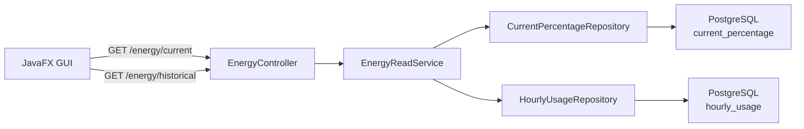
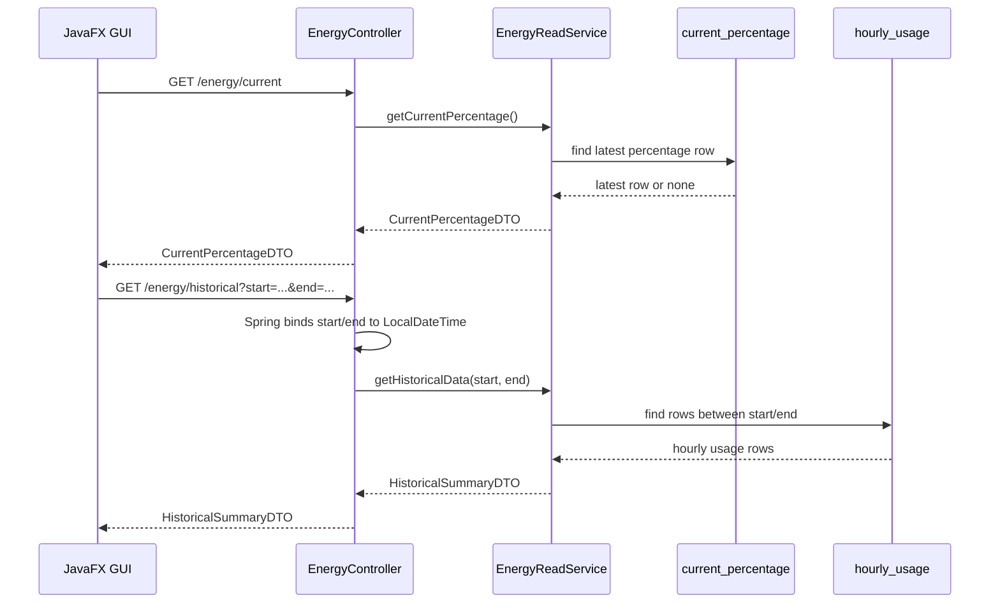

# REST API Module

## Purpose

`rest-api` is an independently startable Spring Boot application. It provides the synchronous HTTP boundary used by the JavaFX GUI.

It reads DB-backed data from PostgreSQL and does not calculate or write the core Usage/Percentage business values.

## Tech Stack

| Area | Implementation |
|---|---|
| Runtime | Java 25 |
| Framework | Spring Boot 4.0.3 |
| REST | Spring Web MVC |
| Persistence | Spring Data JPA, Hibernate |
| Database | PostgreSQL at runtime |
| Migration | Flyway |
| JSON | Spring/Jackson HTTP serialization |

## Main Components

| Class / Package | Responsibility |
|---|---|
| `RestApiApplication` | Spring Boot entry point. |
| `EnergyController` | Thin HTTP boundary: exposes `/energy/current` and `/energy/historical` and delegates to `EnergyReadService`. The `start`/`end` query parameters are bound directly to `LocalDateTime` (Spring parses them). |
| `service/EnergyReadService` | Loads the data from the repositories and maps it to response DTOs, so the controller holds no data-access logic. |
| `CurrentPercentageDTO` | Response DTO for current percentage data. |
| `HistoricalSummaryDTO` | Response DTO for `/energy/historical`: aggregated totals (community produced/used, grid used) over the range. |
| `HistoricalUsageDTO` | Internal per-row mapping that the service sums into the summary; not returned to the client directly. |
| `entity/CurrentPercentageEntity` | Read model for table `current_percentage`. |
| `entity/HourlyUsageEntity` | Read model for table `hourly_usage`. |
| `CurrentPercentageRepository` | Reads the latest percentage row. |
| `HourlyUsageRepository` | Reads hourly usage rows by time range. |
| `db/migration/V1__create_energy_tables.sql` | Flyway migration for schema validation/recreation. |

## Configuration

File: `rest-api/src/main/resources/application.properties`

| Property | Current Value / Meaning |
|---|---|
| `server.port` | `8080` |
| `spring.datasource.url` | `jdbc:postgresql://localhost:5432/energy_community` |
| `spring.jpa.hibernate.ddl-auto` | `validate` |

## Endpoints

| Method | Path | Behavior |
|---|---|---|
| `GET` | `/energy/current` | Returns the latest row from `current_percentage`; returns zero values if no data exists. |
| `GET` | `/energy/historical?start=...&end=...` | Returns the aggregated totals (community produced/used, grid used) of the `hourly_usage` rows between `start` and `end`. |

Accepted date formats for historical parameters:

- ISO local datetime, for example `2026-05-16T00:00:00`.

`start` and `end` are bound directly to `LocalDateTime` parameters, so Spring parses them and returns
`400 Bad Request` for an invalid date format. A reversed range (`start` after `end`) is rejected by
`EnergyReadService` with `400 Bad Request`.

## Runtime Flow



## Sequence Diagram



## Start Command

```powershell
cd rest-api
.\mvnw.cmd spring-boot:run
```

## Verification

```powershell
cd rest-api
.\mvnw.cmd clean package
```

Manual checks:

```powershell
curl http://localhost:8080/energy/current
curl "http://localhost:8080/energy/historical?start=2026-05-16T00:00:00&end=2026-05-16T23:59:59"
```

Important checks:

- REST API starts independently.
- It reads PostgreSQL.
- It does not publish RabbitMQ messages.
- It does not write Usage or Percentage business values.
- It returns DTOs rather than raw JPA entities.
