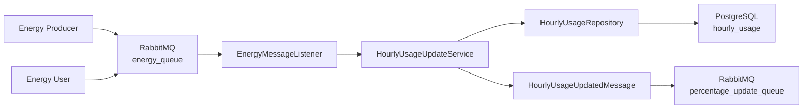
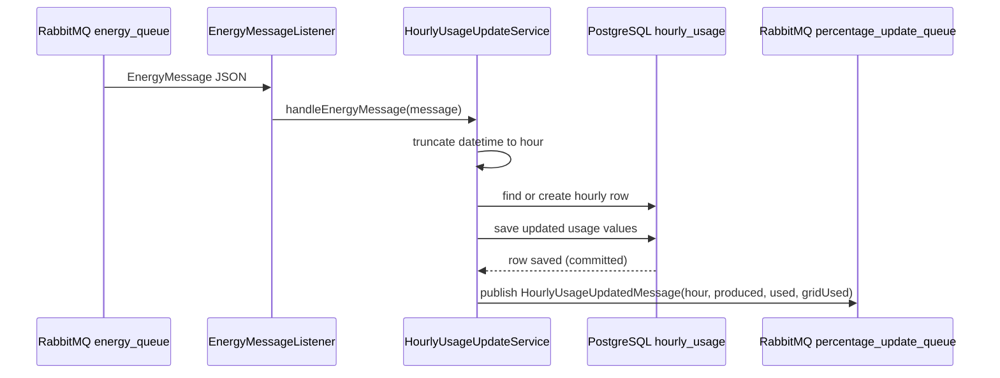

# Usage Service Module

## Purpose

`usage-service` is an independently startable Spring Boot application and one of the two grading-critical core services.

It consumes producer/user messages from RabbitMQ, aggregates them into hourly usage rows, writes PostgreSQL, and publishes an update message for the Percentage Service.

## Tech Stack

| Area | Implementation |
|---|---|
| Runtime | Java 25 |
| Framework | Spring Boot 4.0.3 |
| Messaging | Spring AMQP, `@RabbitListener`, `RabbitTemplate`, JSON converter |
| Persistence | Spring Data JPA, Hibernate |
| Database | PostgreSQL at runtime |
| Migration | Flyway |

## Main Components

| Class / Package | Responsibility |
|---|---|
| `UsageServiceApplication` | Spring Boot entry point. |
| `config/RabbitMqConfig` | Declares the durable queues (`energy_queue`, `percentage_update_queue`) and the AMQP JSON converter as `@Bean`s. |
| `listener/EnergyMessageListener` | RabbitMQ boundary. Receives `EnergyMessage` from `energy_queue` and delegates to service logic. |
| `messaging/EnergyMessage` | Service-local DTO consumed from Producer/User JSON. |
| `messaging/HourlyUsageUpdatedMessage` | Service-local DTO published after usage changes. Carries the hour plus the full hourly snapshot (`communityProduced`, `communityUsed`, `gridUsed`) so the Percentage Service need not read `hourly_usage`. |
| `entity/HourlyUsageEntity` | JPA entity for table `hourly_usage`. |
| `repository/HourlyUsageRepository` | Data access for hourly usage rows. |
| `service/HourlyUsageUpdateService` | Applies the business calculation, writes the DB, publishes the update event. |
| `db/migration/V1__create_energy_tables.sql` | Flyway migration for required tables. |

## Configuration

File: `usage-service/src/main/resources/application.properties`

| Property | Current Value / Meaning |
|---|---|
| HTTP port | none; this module is a RabbitMQ worker |
| `app.queue.name` | `energy_queue` |
| `app.update-queue.name` | `percentage_update_queue` |
| `app.message.producer-type` / `app.message.user-type` | `PRODUCER` / `USER`; message types matched in the service (unknown types are rejected). |
| `spring.datasource.url` | `jdbc:postgresql://localhost:5432/energy_community` |
| `spring.jpa.hibernate.ddl-auto` | `validate` |

## Runtime Flow



## Business Rules

Every message is bucketed to the start of the hour:

```text
2025-01-10T14:34 -> 2025-01-10T14:00
```

For `PRODUCER`:

```text
communityProduced += message.kwh
```

For `USER`:

```text
availableCommunityEnergy = max(communityProduced - communityUsed, 0)
communityPart = min(message.kwh, availableCommunityEnergy)
gridPart = message.kwh - communityPart

communityUsed += communityPart
gridUsed += gridPart
```

Invariant:

```text
communityUsed <= communityProduced
```

The message type is matched explicitly: a `PRODUCER` message increases `communityProduced`, a `USER`
message is applied as usage (community pool first, overflow to grid). Any other or unknown type is
rejected with an `IllegalArgumentException` instead of being silently counted as usage. The matched
types are configurable via `app.message.producer-type` and `app.message.user-type`.

## Sequence Diagram



## Start Command

```powershell
cd usage-service
.\mvnw.cmd spring-boot:run
```

## Verification

```powershell
cd usage-service
.\mvnw.cmd clean package
```

Behavior to confirm during the smoke test (`docs/smoke-test.md`):

- Consumes `energy_queue`.
- Writes `hourly_usage`.
- Publishes `percentage_update_queue` after the database commit.
- Preserves `communityUsed <= communityProduced`.
- Handles user-before-producer order according to message order.
